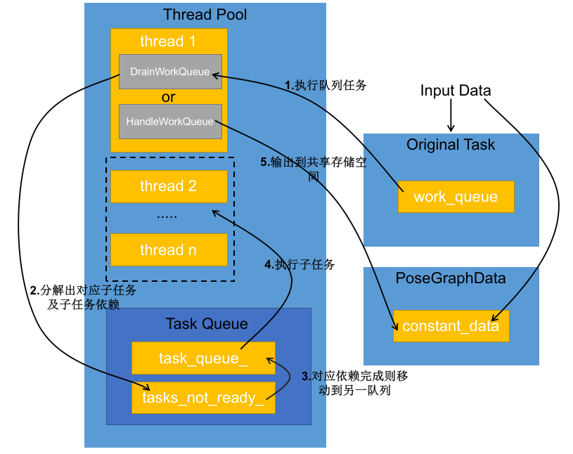

# 拆解Cartographer——线程池与任务队列
> 经观察，线程池与任务队列主要用于cartographer后端处理调度用，达到了三个方面的效果：1)可以配置使用多少线程分配，可以工程化地可调节性能; 2）通过增加依赖项以及任务队列缓冲任务，实现任务间解耦; 3)从某种程度更高地利用资源，增加计算速度。而cartographer后端也确实需要一些性能优化的工具实现，该部分进行暴力的回环检测（多分辨率地图构建与回环约束增加）恰恰是很必要的，再次对谷歌大佬们的实现能力惊叹佩服。**另外，须强调的是，后端的线程池与任务队列就好像是该部分实现的骨架，从实现的角度上基本上要搞清楚数据流就需要把该部分搞清楚，而从算法模块的角度上则考虑对应的一个个单元任务即可，不用过度陷于局部，挑重点即可。**
## 前言
在后端线程池实现上，涉及一下数据结构，进行一下记录：
- PoseGraph2D(mapping/internal/2d/pose_graph_2d.h)
- ThreadPool(common/thread_pool.h)
- ConstraintBuilder2D（mapping/internal/constraints/constraint_builder_2d.h）
- OptimizationProblem2D（mapping/internal/optimization/optimization_problem_2d.h）
- Task（common/task.h)
- WorkQueue（mapping/internal/work_queue.h)

## 概况
在后端中线程池与任务队列是放在一起的，并且结合外界的运行逻辑共同实现了后端优化及回环检测，大概流程则是通过前端的输入数据作为事件触发后续任务，不同数据触发不同主任务，后续通过主线程1来分解任务及安排对应依赖，接着把子任务才存在线程池中的任务队列中，接着的子任务才是消耗时间最大的地方并发挥后端主要功能。其中分三个主要元素：**线程池**，**任务队列**，**相互操作与互斥锁**。该部分后续进行详细说明。大概流程如下图1：

图一

## 线程池
在图1中，分了线程1与线程2至n，同为不同线程，但是作用却不同，线程1作为主线程，不断根据条件切换DrainWorkQueue（分解）HandleWorkQueue（优化）两个状态，充当主要大脑的作用，其余辅助线程则协助提供优化的材料，即构建回环约束（构建多分辨率地图、回环检测、计数) 

## 任务队列
该处任务队列指代地方有两处，一处为线程中管理的两级任务队列（分就绪队列task_queue_与缓存队列tasks_no_ready_）来处理子任务;另一处为外部存储的original task（原有父任务）用于给主线程分解，该部分亦是把前端输入的数据作为事件任务缓存起来给主线程逐个处理。

## 相互操作互斥锁
多个线程进行协同处理数据，则需要考虑交互操作以及对应锁如何添加。

## 后记
- 最近一次修改：22/08/08
- 后续补充以下细节：
    - 线程池对应任务图，以及对应分解阶段，优化阶段，子任务阶段（后续链接出不同的任务）
    - 任务队列对应的任务状态图，依赖计算机制（后续引出task的数据结构以及对应的考虑）
    - 共用存储空间的数据结构解析图，及对应的互斥锁设置，以及对应函数接口对应函数接口图（posegraph，thread pool，constrain_builder）
    - 代码实现
      - 已把对文件扣除来，另外换成对应通用库
      - 使用原来的代码结构，不重新设计
      - 重新设计线程池进行实现
      - 后续根据carto流程设计对应任务，并使用线程池进行分工处理编写示例代码
